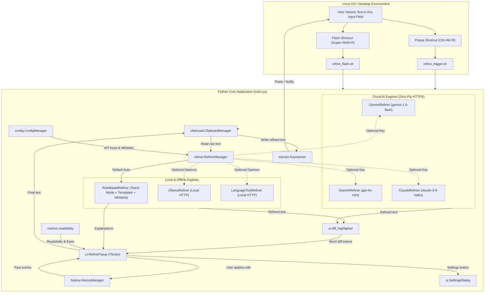

# Architecture & System Design: Universal Sentence Refiner

This document describes the architectural design, component interactions, and execution lifecycle of the Universal Sentence Refiner.

---

## 1. Architectural Principles & Constraints

1. **Zero Third-Party Pip Packages**:
   The entire backend is built strictly using the Python 3 standard library (`re`, `urllib.request`, `tkinter`, `difflib`, `subprocess`, `argparse`, `shutil`, `json`, `pathlib`, `os`, `time`).
2. **Dual-Path Intelligence (Offline + Cloud AI)**:
   - **Offline Path**: Fully private deterministic rule engine with explanation tracking ("Teach Mode"), local Ollama daemon, or local LanguageTool server.
   - **Cloud AI Path**: Native HTTPS client (`urllib.request`) connecting directly to Google Gemini, OpenAI (ChatGPT), and Anthropic (Claude) without third-party SDKs.
3. **Cross-Application Interoperability**:
   Works universally across any application running on Linux (Electron apps like Antigravity IDE/Slack/VS Code, Chromium/Firefox browsers, native GTK/Qt applications, and terminals).
4. **Clean Domain Separation**:
   Code is partitioned into focused, single-responsibility subpackages:
   - `refiner/`: NLP, rule-based polisher, Teach mode explanations, and AI API connectors.
   - `metrics/`: Linguistic readability analysis (Flesch Reading Ease, Grade Level).
   - `config/`: Configuration, whitelist, dynamic snippets expander, and API keys.
   - `history/`: Persistent audit logging and undo buffer.
   - `clipboard/`: Cross-environment clipboard extraction and population.
   - `injector/`: OS-level keystroke injection and desktop notifications.
   - `ui/`: Desktop graphical user interface (Tkinter), diff tokenizer, and settings dialog.
   - `tests/`: Automated unit test suite.

---

## 2. Component Flow Diagram

---

## 3. Subpackage Breakdown (under `src/`)

### `src/refiner/`
- [`base.py`](file:///home/sunil-bakale/IdeaProjects/dev-refine-sentences/src/refiner/base.py): Abstract `BaseRefiner` interface.
- [`rules.py`](file:///home/sunil-bakale/IdeaProjects/dev-refine-sentences/src/refiner/rules.py): Offline deterministic NLP rules engine with whitelist masking, dynamic snippet expansion (`{{date}}`, `{{time}}`, `{{year}}`), typo resolution, grammar correction, and Teach Mode explanation tracking.
- [`spelling.py`](file:///home/sunil-bakale/IdeaProjects/dev-refine-sentences/src/refiner/spelling.py): Zero-pip offline spelling engine using Peter Norvig's edit-distance candidate ranking + comprehensive developer lexicon.
- [`gemini.py`](file:///home/sunil-bakale/IdeaProjects/dev-refine-sentences/src/refiner/gemini.py): Standard library HTTP client for Google Gemini API.
- [`openai.py`](file:///home/sunil-bakale/IdeaProjects/dev-refine-sentences/src/refiner/openai.py): Standard library HTTP client for OpenAI API.
- [`claude.py`](file:///home/sunil-bakale/IdeaProjects/dev-refine-sentences/src/refiner/claude.py): Standard library HTTP client for Anthropic Claude API.
- [`ollama.py`](file:///home/sunil-bakale/IdeaProjects/dev-refine-sentences/src/refiner/ollama.py): Standard library HTTP client for local Ollama instances.
- [`languagetool.py`](file:///home/sunil-bakale/IdeaProjects/dev-refine-sentences/src/refiner/languagetool.py): Standard library HTTP client for local LanguageTool server.
- [`manager.py`](file:///home/sunil-bakale/IdeaProjects/dev-refine-sentences/src/refiner/manager.py): Engine coordinator providing automatic fallback resolution across offline and cloud backends.

### `src/metrics/`
- [`readability.py`](file:///home/sunil-bakale/IdeaProjects/dev-refine-sentences/src/metrics/readability.py): Flesch Reading Ease, Flesch-Kincaid Grade Level, and syllable counter.

### `src/config/`
- [`settings.py`](file:///home/sunil-bakale/IdeaProjects/dev-refine-sentences/src/config/settings.py): Manages `~/.config/refine_tool/config.json`, technical term whitelist, shortcut snippet expansions, and API keys.

### `src/history/`
- [`history_manager.py`](file:///home/sunil-bakale/IdeaProjects/dev-refine-sentences/src/history/history_manager.py): Persistent audit log and undo buffer storing the last 50 refinements.

### `src/clipboard/`
- [`manager.py`](file:///home/sunil-bakale/IdeaProjects/dev-refine-sentences/src/clipboard/manager.py): Universal clipboard interface with multi-backend fallback.

### `src/injector/`
- [`injector.py`](file:///home/sunil-bakale/IdeaProjects/dev-refine-sentences/src/injector/injector.py): Keystroke injection via `ydotool`, `wtype`, or `xdotool`. Sends desktop notifications via `notify-send`.

### `src/ui/`
- [`diff_highlighter.py`](file:///home/sunil-bakale/IdeaProjects/dev-refine-sentences/src/ui/diff_highlighter.py): Word-level diff tokenizer powered by `difflib.SequenceMatcher`.
- [`settings_dialog.py`](file:///home/sunil-bakale/IdeaProjects/dev-refine-sentences/src/ui/settings_dialog.py): Tabbed settings GUI for keys, whitelist, and snippets.
- [`popup.py`](file:///home/sunil-bakale/IdeaProjects/dev-refine-sentences/src/ui/popup.py): Clean, dark-mode Tkinter modal providing live word diff rendering, Teach Mode explanations, readability metrics, and tone selection.

### `src/daemon/`
- [`server.py`](file:///home/sunil-bakale/IdeaProjects/dev-refine-sentences/src/daemon/server.py): Persistent UNIX domain socket daemon (`~/.config/refine_tool/daemon.sock`) keeping modules, regexes, and clipboard warm in RAM for sub-5ms latency.
- [`client.py`](file:///home/sunil-bakale/IdeaProjects/dev-refine-sentences/src/daemon/client.py): Fast socket client connector for instant hotkey dispatch and synchronous in-RAM text query.

### `src/web_server/`
- [`server.py`](file:///home/sunil-bakale/IdeaProjects/dev-refine-sentences/src/web_server/server.py): Stdlib `http.server` serving static documentation and developer playground, connecting HTTP `/api/refine` requests directly to the in-RAM daemon socket.

### `scripts/`
- [`start.sh`](file:///home/sunil-bakale/IdeaProjects/dev-refine-sentences/scripts/start.sh): Start daemon & web portal services.
- [`stop.sh`](file:///home/sunil-bakale/IdeaProjects/dev-refine-sentences/scripts/stop.sh): Stop all services cleanly.
- [`restart.sh`](file:///home/sunil-bakale/IdeaProjects/dev-refine-sentences/scripts/restart.sh): Restart services.
- [`status.sh`](file:///home/sunil-bakale/IdeaProjects/dev-refine-sentences/scripts/status.sh): Probe live health of daemon & web portal.
- [`launch_portal.sh`](file:///home/sunil-bakale/IdeaProjects/dev-refine-sentences/scripts/launch_portal.sh): Open portal in browser.
- [`setup_shortcuts.sh`](file:///home/sunil-bakale/IdeaProjects/dev-refine-sentences/scripts/setup_shortcuts.sh): Linux GNOME shortcut registrar.
- [`setup_shortcuts_mac.sh`](file:///home/sunil-bakale/IdeaProjects/dev-refine-sentences/scripts/setup_shortcuts_mac.sh): macOS Quick Actions & Services registrar.
- [`setup_shortcuts_win.bat`](file:///home/sunil-bakale/IdeaProjects/dev-refine-sentences/scripts/setup_shortcuts_win.bat): Windows desktop global hotkey generator.
- [`refine_shortcuts.ahk`](file:///home/sunil-bakale/IdeaProjects/dev-refine-sentences/scripts/refine_shortcuts.ahk): Optional AutoHotkey script for Windows.
- [`refine_trigger.sh`](file:///home/sunil-bakale/IdeaProjects/dev-refine-sentences/scripts/refine_trigger.sh): Hook for desktop popup shortcut.
- [`refine_flash.sh`](file:///home/sunil-bakale/IdeaProjects/dev-refine-sentences/scripts/refine_flash.sh): Hook for desktop flash replace shortcut.

### `packaging/`
- [`build_deb.sh`](file:///home/sunil-bakale/IdeaProjects/dev-refine-sentences/packaging/build_deb.sh): Builds a production `.deb` package (`dist/refine-sentences_1.2.0_all.deb`) for Debian/Ubuntu.
- [`install_user.sh`](file:///home/sunil-bakale/IdeaProjects/dev-refine-sentences/packaging/install_user.sh): Zero-sudo user installer configuring `~/.local/bin` and systemd user services.
- [`refine-daemon.service`](file:///home/sunil-bakale/IdeaProjects/dev-refine-sentences/packaging/refine-daemon.service): Systemd user service unit for daemon.
- [`refine-web.service`](file:///home/sunil-bakale/IdeaProjects/dev-refine-sentences/packaging/refine-web.service): Systemd user service unit for web portal.

### `web/`
- Modular vanilla JavaScript and modern Catppuccin dark-mode CSS:
  - `css/styles.css`: Responsive, GitHub/Tailwind dark theme.
  - `js/modules/diff.js`: Word-level LCS diff algorithm.
  - `js/modules/metrics.js`: In-browser Flesch Reading Ease & Grade Level engine.
  - `js/modules/rules_engine.js`: In-browser deterministic rule engine for 100% offline static testing.
  - `js/modules/api_client.js`: HTTP API client bridging web UI with local daemon socket.
  - `js/modules/tabs.js`: Tabbed navigation and interactive copy helpers.
  - `js/app.js`: Main frontend orchestrator.

### `tests/`
- [`test_all.py`](file:///home/sunil-bakale/IdeaProjects/dev-refine-sentences/tests/test_all.py): Unit test suite covering all domains, web server endpoints, and daemon functionality (21 passing tests).

